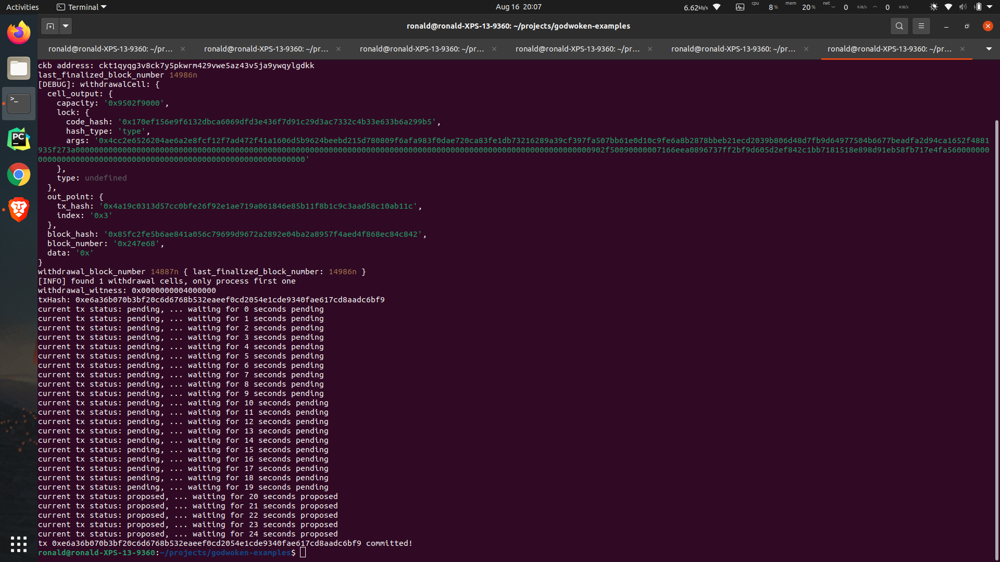

# 1.A screenshot of the console output immediately after running the "unlock" command.

# 2. The Ethereum address that you've used for your Layer 2 account.

`0x2341a1cd44e0b1da225f1005917e9a50ca6db842`

# 3. The Nervos Layer 1 address associated with the private key passed to "unlock" command (in text format). This is "ckb address" in the console output..

`ckt1qyqg3v8ck7y5pkwrm429vwe5az43v5ja9ywqylgdkk`