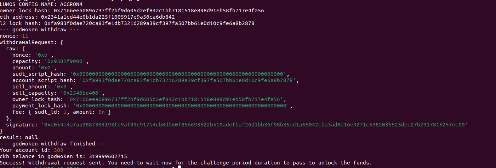

# 1. A screenshot of the console output immediately after running the withdraw command.

# 2. The Ethereum address that you've used for your Layer 2 account.

`0x2341a1cd44e0b1da225f1005917e9a50ca6db842`

# 3. The Nervos Layer 1 address that you passed to withdraw command .

`ckt1qyqg3v8ck7y5pkwrm429vwe5az43v5ja9ywqylgdkk`